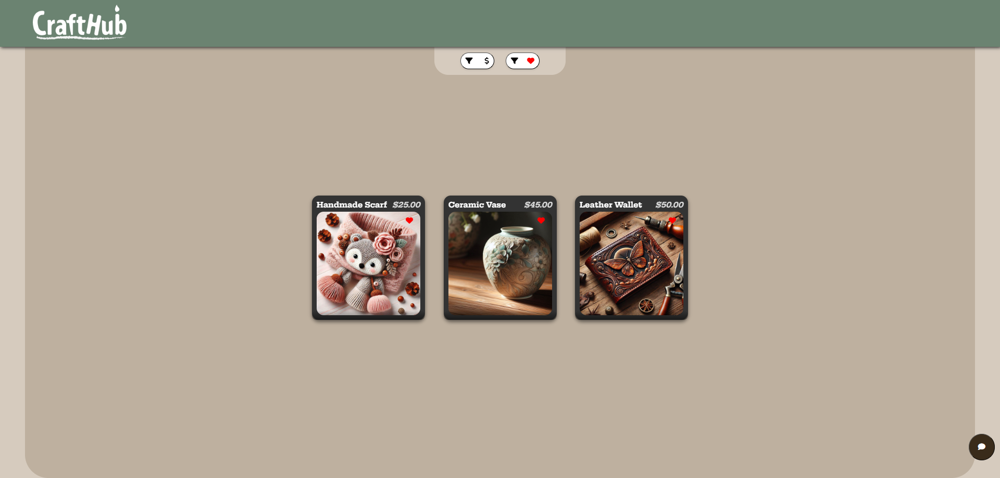
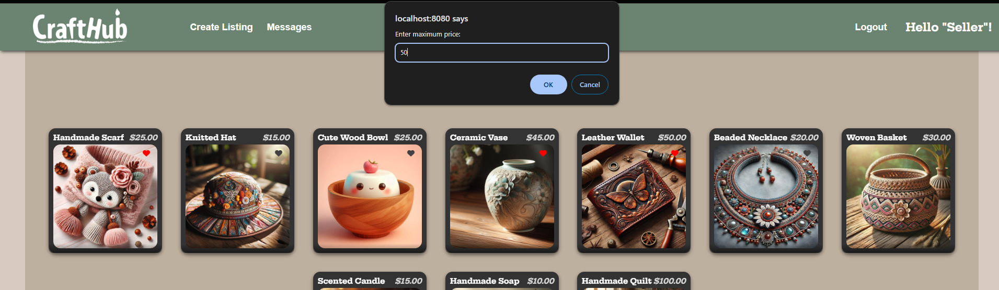

# CraftHub

CraftHub is a marketplace app for buying and selling handmade goods. It is an interactive platform for users to explore unique, handmade items, message sellers, and create listings. Currently, the app is designed for two users: a seller (admin user) and a buyer.

- **Seller (ADmin User)**: Can create listings, mark items as sold, and remove items. Sellers can also communicate with buyers through messages.
- **Buyer**: Can browse and filter items, mark items as favourites, and message sellers about items. Buyers must login to contact sellers.


## Tech Stack

- **Frontend**: JavaScript, jQuery, CSS (preprocessed with Sass), EJS for rendering.
- **Backend**: PostgreSQL for database management.

## Features

### 1. Login
- Login functionality using `userID`.
- Two users in the database:
  - **Admin User (Seller)** (ID: 1)
  - **Buyer** (ID: 2)
<br>


### 2. Home Page
- Displays all available items with clickable links to detailed item pages.
- Features:
  - **Favourites**: Buyers can favourite items.
  - **Filtering**: Filter items by favourites or by price (minimum and maximum values required).
<br>







### 3. Create Listing (Admin Only)
- Accessible only to the seller.
- Create new listings for items to sell.
- Restrictions and validations:
  - Required fields: Item title, description, price, and at least one image.
  - Price must be a positive number.
  - Images must be in a valid format (e.g., PNG, JPEG).
<br>


### 4. Messages
- Buyers and sellers can message back and forth.
- Current functionality:
  - Messages are refreshed on the back-end; users do not need to refresh the page to view new messages.
  - Only one chat is available, which pertains to all items and is not item-specific.
- Planned improvements:
  - Support for multiple users, integrating seamlessly with the existing back-end message refreshing system.
  - Conversations tied to specific items for clarity and organization.
<br>


### 5. Detailed Item Page
- Displays:
  - User who posted it
  - Title
  - Price
  - Item picture(s)
  - Description
- Admin-specific actions:
  - Remove items
  - Mark items as sold


- Buyer-specific actions:
  - Contact seller (only when logged in)
  - Non-logged-in users see a prompt: "Please log in to contact seller."


## Future Development

### Enhancements to Existing Features
1. **Price Filtering**
   - Add functionality to filter by only minimum or only maximum price.
   - Display the entered filter values for confirmation.

2. **Header Update**
   - Remove the "Create Listing" link for buyers, as it is admin-only.

3. **Messaging System**
   - Update messaging to support:
     - Multiple users.
     - Conversations tied to specific items.

### New Features
1. **Rating System**
   - Allow buyers to rate products and sellers on a scale of 1-5.
   - Allow sellers to rate buyers on a scale of 1-5.
   - Ratings would be displayed in messages app, and additionally, on the Seller's Page (new feature below)
2. **Inventory/Attribute Tracking**
   -  Allow tracking of sellers inventory.
      - Once inventory reaches zero, change item status to 'Not Available' thus removing it from buyer view.
   - Allow different attributes for items such as: color, size, material, etc.
3. **User (Seller) Pages**
   - Allow buyers to view sellers to see other available items they are selling.

## Installation
1. Fork and Clone [the repository](https://github.com/semblant/CraftHub):
   ```bash
   git clone <your-repository-url>
   ```
2. Install dependencies:
   - chalk
   - cookie-session
   - dotenv
   - ejs
   - express
   - morgan
   - pg

   ```bash
   npm install
   ```

3. Setup the database:
   - Ensure PostgreSQL is installed.
   - Run the provided SQL scripts to set up the database.
   - Copy the `.env.example` file to `.env`: use the following command in your terminal to copy the example env file:
   ```bash
   cp .env.example .env
   ```
   - Edit the `.env` file: Open the `.env` file in a text editor and update the fields with your PostgreSQL database connection details.
   ```plaintext
   DB_HOST=your-database-host
   DB_PORT=5432
   DB_NAME=your-database-name
   DB_USER=your-username
   DB_PASSWORD=your-password
   ```
   - To run the intial seed, or after you make any changes to the database, run the following command:
   ```bash
   npm run db:reset
   ```

4. Start the server:
   ```bash
   npm run local
   ```

5. Access the application in your browser at `http://localhost:8080`.

